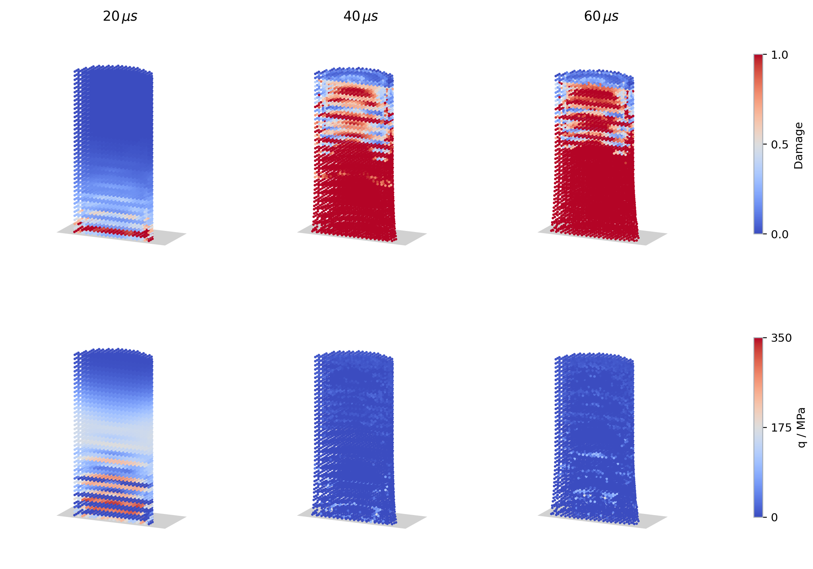
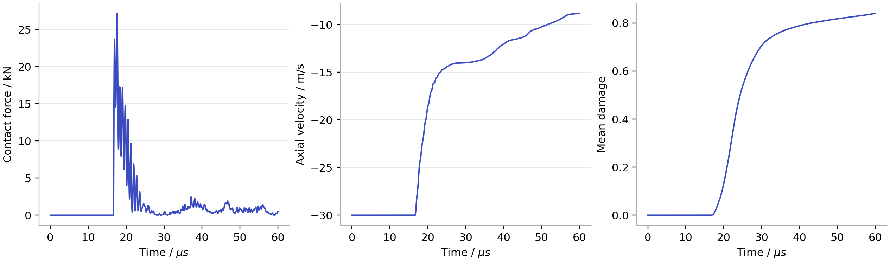
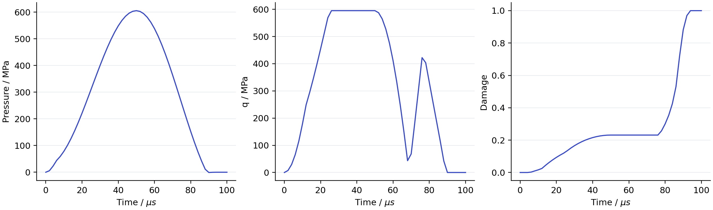
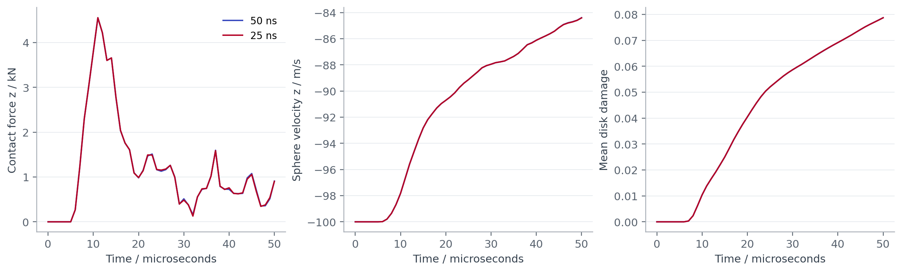
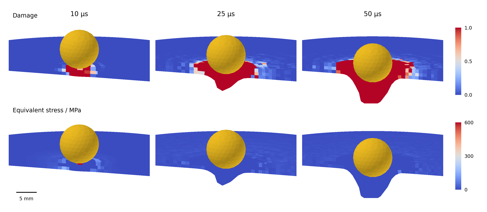
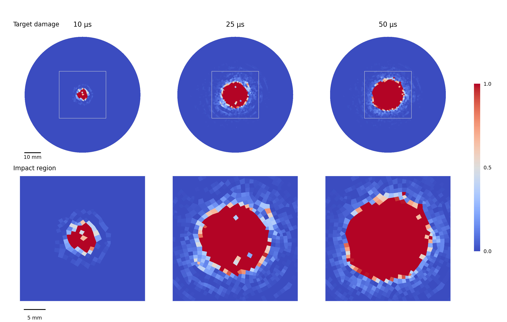

# HJC correspondence material

`HJC Correspondence` adds pressure-dependent strength, strain-rate sensitivity,
irreversible crushing and scalar material damage to the existing corotational
correspondence interface. The integration conventions are described below.
Density, stress and time units must be consistent.

## Taylor cylinder impact

```sh
python3 generate_taylor.py --output taylor
cd taylor
/path/to/Peridigm taylor.xml
python3 ../plot_taylor.py taylor.e
```

The standard-library generator creates a full three-dimensional cylinder of
diameter 10 mm and length 20 mm, initially 0.5 mm above the wall at z=0, moving
at -30 m/s along z. Cylinder spacing is 0.5 mm (12,640 points), the horizon is
3.01 times spacing, and the hourglass coefficient is 0.05. A fixed 10 ns
timestep runs to 60 microseconds. This uses classical Taylor cylinder-impact
geometry with illustrative concrete parameters, rather than a calibration
against Taylor's metal-impact experiments.

The fixed wall is a single layer of points with zero prescribed displacement
in all directions. Its x/y spacing is half the cylinder spacing, cell thickness
equals cylinder spacing, and centers lie at z=-spacing/2; cell volumes are
spacing cubed divided by four. No bonds join the blocks. Native `Short Range
Force` contact uses zero friction coefficient and contact radius equal to
cylinder spacing. The spring constant is derived in the generator from the
initial longitudinal modulus, scaled by `--wall-factor` (default 2). Contact
search updates every 0.1 microseconds with radius three cylinder spacings.
This is a discrete wall: pair-force directions follow point separation, rather
than an analytic plane normal. Denser wall sampling reduces contact gaps.

```sh
# Separate directories for refinement checks:
python3 generate_taylor.py --dt 5e-9 --output taylor_half_dt
python3 generate_taylor.py --spacing .001 --dt 2e-8 --output taylor_coarse
# Text discretization can also run directly in parallel:
mpiexec -np 4 /path/to/Peridigm taylor.xml
epu -auto taylor.e.4.0
```

The plotter needs NumPy, netCDF4 and Matplotlib. Field output is saved every
microsecond; the small `taylor_history.h` stores block sums every timestep.
Global-only history is already written as a single file in parallel runs;
only the field output needs merging.
The plotter compares contact impulse with cylinder momentum change, and checks
finite fields, positive deformation determinants, irreversible histories,
fixed wall displacement and saved-frame penetration below 10% of spacing.
Wall velocities in output include the Verlet final half-kick on constrained
degrees of freedom; prescribed displacement fixes its position. Only cylinder
velocities enter the response histories.



The reference y>=0 half exposes the interior at 20, 40 and 60 microseconds.
Positions include actual displacement at scale one; fields are not smoothed
and fully damaged points remain visible. Fixed color scales, a white background
and blue/gray/red fields follow the example gallery. The gray patch represents
the wall; axes are hidden to keep labels minimal.



Curves show total cylinder contact force, mass-averaged axial velocity and
volume-averaged damage. All cylinder cells have equal volume. CSV histories and
a JSON diagnostic summary accompany the plots. Pass multiple Exodus files with
`--labels` to compare runs. If output resolutions differ, comparisons use the
coarser time grid. Local softening is not mesh objective, so timestep consistency
does not establish spatial convergence or experimental accuracy.

For 10 ns versus 5 ns, every-step contact-force and mean-damage peak-normalized
RMSE are 0.458% and 0.0648%. At 60 microseconds, local damage RMS/maximum
differences are 0.0311/0.443; equivalent-stress differences are 8.11/91.6 MPa.
The 1 mm and 0.5 mm meshes have final mean damage 0.898 and 0.840. These local
and spatial differences remain significant despite similar global histories.

## Homogeneous verification example

```sh
python3 generate.py --output run
cd run
/path/to/Peridigm hjc.xml
# Or: mpiexec -np 2 /path/to/Peridigm hjc.xml
```

The generator uses only the Python standard library. It creates a 20 mm cube
of 8 x 8 x 8 points, 2.5 mm spacing, with horizon 3.01 times the spacing.
The fixed timestep is 0.1 microseconds and the duration is 100 microseconds.
All points follow the same affine compression/shear cycle:

```text
h = sin(pi*t/100 microseconds)^2
F = [1-.015h    .04h       0    ]
    [   0     1-.015h    .02h  ]
    [   0        0     1-.015h ]
```

This is a homogeneous material/kinematic patch test. It exercises compaction,
plastic shear, damage and unloading, without free-surface dynamics or crack
localization. The supplied parameters demonstrate the model; they are not a
calibration. The Exodus output includes `HJC_Pressure` (compression positive),
`Von_Mises_Stress`, `HJC_Damage`, `HJC_Plastic_Volume`,
`Equivalent_Plastic_Strain`, `HJC_Density_Measure` and `HJC_Acoustic_Modulus`.



Use separate output directories for `--dt 5e-8`, `--cells 12`, another
`--horizon-ratio`, or `--hourglass`. The last option controls the existing
correspondence stabilization. A homogeneous patch does not establish the
stability of nonuniform correspondence solutions or mesh-objective softening.
The base material integrates a corotational rate; rapidly rotating prescribed
motion also requires timestep refinement to control kinematic truncation error.
Peridigm's initial critical-step estimate uses the initial bulk modulus;
the cubic EOS can become stiffer during compression. Specify a sufficiently
small `Fixed dt` and check timestep refinement for dynamic applications.

## Sphere impact on an HJC disk

`disk_impact.yaml` adapts the repository's existing
[`disk_impact`](../disk_impact/disk_impact.yaml) example. It reuses the same
`disk_impact.g` mesh: a 74 mm diameter, 2.5 mm thick disk and a 10 mm diameter
elastic sphere (14,445 disk points and 2,522 sphere points). The sphere starts
at -100 m/s along z. Both bodies are otherwise free; no motion is prescribed
after the initial conditions.

The disk uses the HJC demonstration parameters above. Its original critical
stretch bond-damage model is removed, so the example isolates HJC material
damage without an additional bond-breaking law. The elastic sphere, horizons,
contact radius and contact stiffness follow the upstream example. An initial
rigid translation moves the sphere 8 mm closer to the disk, leaving a 0.5 mm
surface gap and shortening the free-flight interval. Contact search runs every
10 steps; a fixed 50 ns timestep and a 50 microsecond end time resolve the early
impact, wave propagation and unloading response.

Run from this directory using a YAML-enabled build:

```sh
/path/to/Peridigm disk_impact.yaml
python3 plot_impact.py hjc_disk_impact.e --labels "50 ns"
```



The plotter needs NumPy, netCDF4 and Matplotlib. It also writes CSV histories
and a JSON summary, checks positive disk deformation determinants, finite
fields, irreversible histories and free-body momentum balance. `Contact_Force`
already includes point volume, so the sphere's plotted z-force is the direct
sum of its z-components. Momentum
is computed as a vector sum from point velocities and masses; the existing
`Global_Linear_Momentum` diagnostic sums block-wise magnitudes and is not used
for this conservation check.

For a timestep comparison, copy the YAML, set `Fixed dt` to `2.5e-8`, change
`Output Frequency` to `40` and use a different output filename. Then pass both
Exodus files to `plot_impact.py --labels "50 ns" "25 ns"`. Keeping the search
frequency at 10 steps also halves its physical search interval. For MPI, first
decompose the existing mesh with the usual SEACAS `decomp` command; use `epu`
to merge partitioned output before plotting.

### Impact contours

```sh
python3 plot_contours.py hjc_disk_impact.e
```



The figure shows the central impact region at 10, 25 and 50 microseconds from
the 25 ns run. Its white background, blue/gray/red field colors and gold sphere
follow the repository's [example gallery](../../README.md#examples). Each field
uses one fixed color scale across all frames. The reference y=0 section retains
the y>=0 half of the disk beneath the complete elastic sphere. The orthographic
view uses a displacement scale of one and is cropped to the impact region.

Material-point values are mapped by `Element_Id` to the original mesh cells
without smoothing the fields. For visualization only, displacements are
volume-averaged at shared mesh nodes and interpolated along cut edges. Fully
damaged cells remain visible. The plotter uses the same dependencies as the
response plotter; `--times` selects saved times in microseconds, `--mesh`
selects the original mesh, `--overview` shows the entire half disk, and
`--output` sets the image path.

For a plan view of target damage:

```sh
python3 plot_contours.py hjc_disk_impact.e --top-view --output impact_damage_top.png
```



The upper row shows the complete target; the outlined 30 mm square is enlarged
below. Both rows use the same 0–1 damage scale. Values belong to the 4,815 cells
on the original upper surface, with no averaging or maximization through the
thickness. The sphere is hidden in this view. In-plane displacements retain a
scale of one; nodal displacement projection is the same as in the section view.

This is an early-time impact demonstration, not a perforation or fragmentation
benchmark. HJC material damage does not remove particles or break bonds. The
demonstration parameters are not calibrated to the original brittle disk.

## Parameters and history

The generated XML lists all required parameters. `Shear Modulus`,
`Compressive Strength`, `Tensile Strength`, `Crushing Pressure`,
`Locking Pressure`, `K1`, `K2` and `K3` have stress units.
`Reference Strain Rate` has inverse-time units. `A, B, C, N, EFMIN, SFMAX,
D1, D2`, both volumetric strains and `Hourglass Coefficient` are dimensionless.
The initial bulk modulus is `Crushing Pressure / Crushing Volumetric Strain`;
an optional `Bulk Modulus` must agree. `Locking Plastic Volumetric Strain`
is the HJC `UL` plastic offset, not the total strain at full compaction.

The six two-step history fields preserve log volume, irreversible plastic
volume, maximum compression, density measure, damage and equivalent plastic
strain. Trial evaluations always start from `STEP_N`, so repeated residual
evaluations do not compound damage. The base correspondence material supplies
the unrotated deformation rate, rotates Cauchy stress, and assembles forces.

The integration choices are:

- Compression is positive in pressure and plastic volume. The accumulated
  log-volume gives `mu=exp(-integral(trace(D)*dt))-1`. Maximum compression records
  irreversible compaction. A linear crushing line joins PC to PL; the locking
  compression is found from the dense polynomial so both branches meet at PL.
  The permanent plastic offset grows linearly from zero to UL. Partial
  compaction unloads along the secant through peak pressure and plastic offset.
  After locking, pressure is cubic in `(mu-UL)/(1+UL)` when that strain is
  positive and linear when it is negative.
- Compression strength is `A*(1-D)+B*(p/FC)^N`; tensile strength is
  `A*max(0,1-D+p/T)`. Strength uses start-of-step damage; the tensile pressure
  cutoff is reapplied after damage growth.
- The rate multiplier is `1+C*log(max(1,rate/rate0))`, capped by SFMAX.
- Initially D=0. Fracture strain is
  `max(EFMIN,D1*max((p+T)/FC,0)^D2)`, as in Meyer [2]. Plastic shear and plastic
  volume increments accumulate damage up to one. Plastic shear continues to
  accumulate at zero strength. Fully damaged material retains confined strength.

These conventions define this implementation. `HJC_Damage` is material damage
and is independent of peridynamic `Bond_Damage`. This material does not delete
points or break bonds; fully damaged material retains confined compressive
strength. Thermal expansion is not supported.

## Tests and references

`ctest -R utPeridigm_HJCCorrespondenceMaterial --output-on-failure` runs
elastic hydrostatic and engineering-shear invariants, low-pressure damage,
damage saturation, tensile cutoff, plastic flow at zero strength, sub-reference
rates, parameter rejection and DataManager history/tensor mapping. An exactly
factorable dense polynomial checks the crushing midpoint, unloading offset
and continuous locking pressure against analytical values.

1. Holmquist, T. J., Johnson, G. R., and Cook, W. H. (1993).
   *A computational constitutive model for concrete subjected to large strains,
   high strain rates, and high pressures*. Proceedings of the 14th
   International Symposium on Ballistics, Quebec, pp. 591-600.

2. Meyer, C. S. (2011). *Development of Geomaterial Parameters for Numerical
   Simulations Using the Holmquist-Johnson-Cook Constitutive Model for Concrete*.
   ARL-TR-5556, pp. 2–7.
   [Report](https://www.govinfo.gov/content/pkg/GOVPUB-D101-PURL-gpo10967/pdf/GOVPUB-D101-PURL-gpo10967.pdf).
3. Taylor, G. I. (1948). *The use of flat-ended projectiles for determining
   dynamic yield stress. I. Theoretical considerations*. Proceedings of the
   Royal Society A, 194, 289–299. [DOI](https://doi.org/10.1098/rspa.1948.0081).
